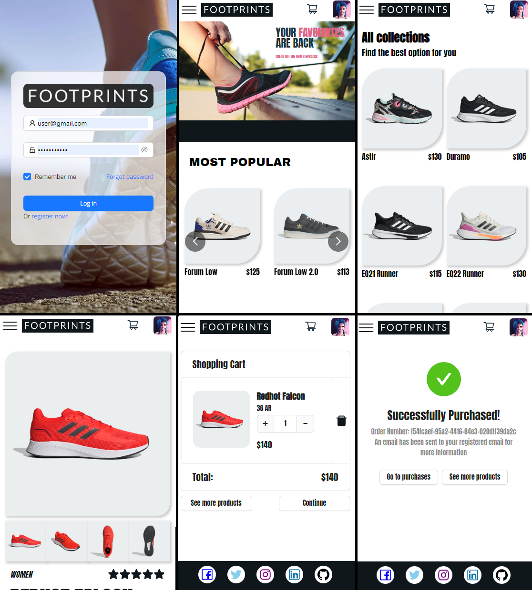

# Ecommerce Project using React and Express

## Overview

This website is running online at this [link](https://aonik10.github.io/shoes-ecommerce/)



## About the website

This project was created solely for learning purposes. As a developer student, I attempted to build a single-page application that anyone can navigate through. However, only individuals with a registered username can interact with the page by selecting products and adding them to their cart

The application is based on a fictional company called                    "Footprints" that sells sport shoes. I had to create my own product database and a server to provide data to the client-side application.

## Frameworks used

1.- React, using create-react-app\
2.- Redux, to manage global states\
3.- React-router-dom, to implement routing\
4.- Express, as back-end server\
5.- Express-session, to set authentication cookies\
6.- bcryptjs and uuid to encrypt passwords and generate uniques ids\
7.- MongoDB and mongoose, as database framework\
8.- Sass and css modules for styling\
9.- Ant-Design, a useful component library

## Upcoming features to be added

1.- Implement a sign-up form, with the option for users to sign up using Google authentication.\
2.- Add a "forgot password" functionality to allow users to reset their passwords if they forget them.\
3.- Include a menu where users can manage their profiles, such as updating their personal information or viewing their order history.\
4.- Add configuration options for payment methods to allow for a smooth checkout process.\
5.- Enable users to save products to their favorites list for easy access in the future.\
6.- Improve the website's visual appearance by enhancing the current styles.\
7.- Upgrades in general, based on user experience

## Running locally

You can clone this repository in order to run this app locally.

```bash
git clone https://github.com/Aonik10/shoes-ecommerce.git
cd shoes-ecommerce
npm install
npm start
```

The project should start running in your browser at http://localhost:3000/

The endpoint to the server is https://home-pc.emipellegrino.com/api, the application wont work if the server is down for some reason. Contact with me for more information at emp10999@gmail.com

## Server side

You'll find the server repository [here](https://github.com/Aonik10/shoes-ecommerce-server)
