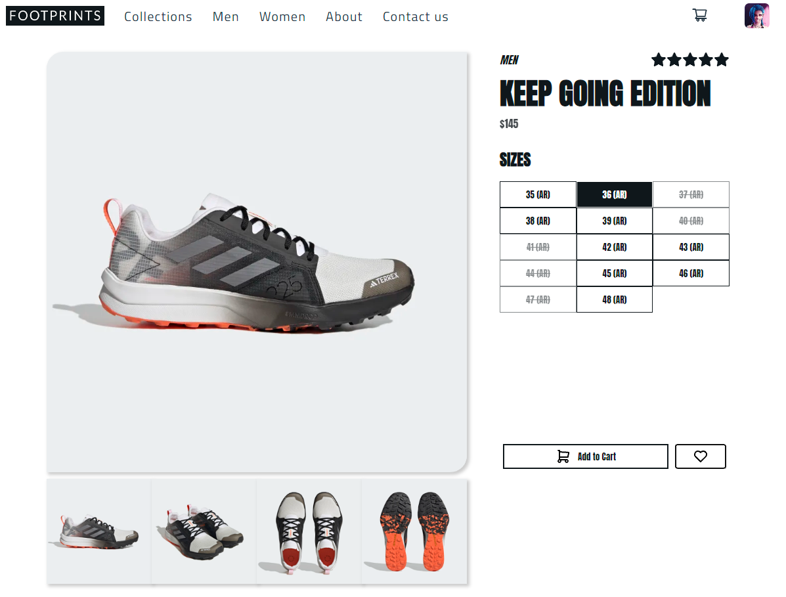

# Ecommerce Project using React and Express

## Overview

This website is running online at this [link](https://aonik10.github.io/shoes-ecommerce/)



## About the website

This project was made only for learning porpouses. I tried to build a single page application where any people can navigate through, but only ones with a registered username could interact with the page to build a cart picking up products.

"FOOTPRINTS" is a fake company which sells sport shoes. I had to build my own database of products just to be able to work with a server which provides the datasource to the client-side application.

## Frameworks used

1.- React, using create-react-app\
2.- Redux, to manage global states\
3.- React-router-dom, to implement routing\
4.- Express, as back-end server\
5.- Express-session, to set authentication cookies\
6.- bcryptjs and uuid to encrypt passwords and generate uniques ids\
7.- MongoDB and mongoose, as database framework\
8.- Sass and css modules for styling\
9.- Ant-Design, a useful component library

## Upcoming features to be added

1.- Create a sign up form (connected to google auth if posible)\
2.- Add a menu where the user can manage his profile\
3.- Add payment methods configuration\
4.- Make the site fully responsive\
5.- Make the website looks better (I apologize for the current styles)

## Running locally

You can clone this repository in order to run this app locally.

```bash
git clone https://github.com/Aonik10/shoes-ecommerce.git
cd shoes-ecommerce
npm install
npm start
```

The app should start running in your browser at http://localhost:3000/

## Server side

You'll find the server repository [here](https://github.com/Aonik10/shoes-ecommerce-server)
